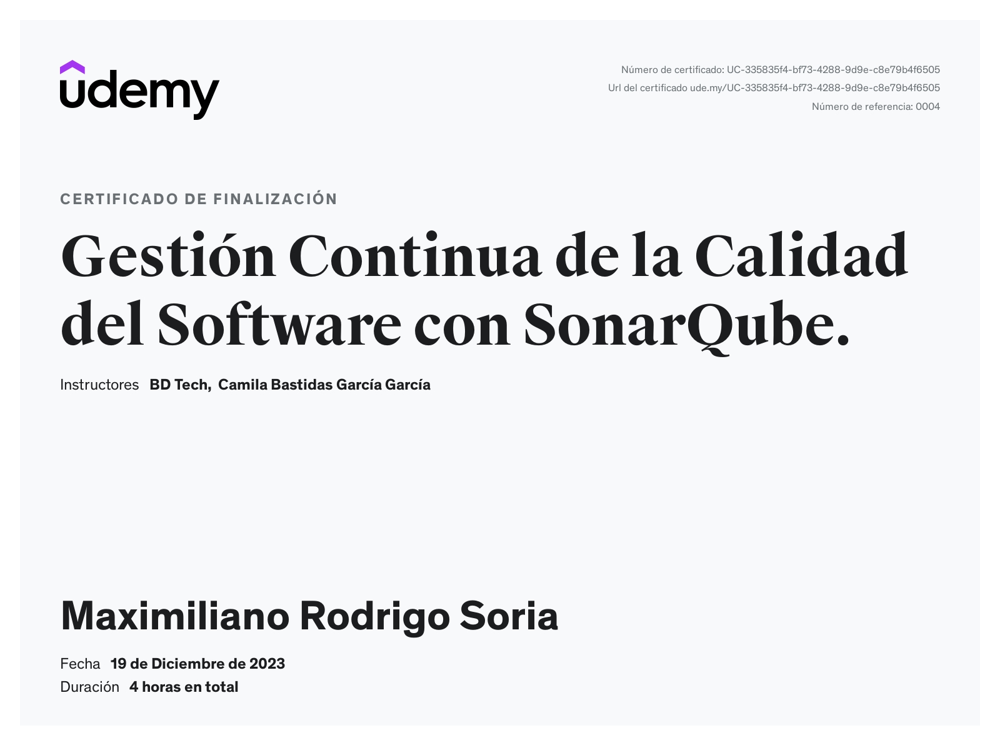

  
  
  

 
 

 

### ⭐ Que es SonarQube?

SonarQube es una herramienta ampliamente utilizada en el desarrollo de software Java Backend para mejorar la calidad del código y garantizar la seguridad y mantenibilidad del proyecto. A continuación, proporciono información detallada sobre SonarQube, su función y cómo se integra en el entorno de desarrollo Java.
 
### ⭐ Curso de Udemy

Estos ejemplo esta dados por el curso de Udemy **Gestión Continua de la Calidad del Software con SonarQube**

Link: https://www.udemy.com/course/gestion-continua-de-la-calidad-del-software-con-sonarqube/

#### Objetivo

En este curso de transformación de datos con Knime de básico a intermedio abordaremos los siguientes temas:

- Identificar los Issues que reporta SonarQube, de esa forma interpretar los diferentes tipos (Bugs, Vulnerabilidades, Code Smells) y las severidades para definir una estrategia inteligente de mejora.

- Interpretar las métricas de calidad como la covertura de pruebas, duplicación de código y complejidad de las funcionalidades.

- Gestionar la deuda técnica para mantener la calidad del proyecto con altos estándares de calidad según los atributos de Confiabilidad, Mantenibilidad y Seguridad.

- Usar la escala de SQALE (Software Quality Assessment based on Lifecycle Expectations) para evaluar la calidad del proyecto.

- Definir compuertas de calidad en SonarQube para determinar si un proyecto esta listo o no para ser desplegado en producción.

- Comparación de SonarQube con otras herramientas similares disponibles.

Por otro lado el curso también cuenta con un componente técnico importante con el cual al finalizarlo usted será capaz de:

- Instalar el servidor web de SonarQube desde cero usando un servidor Ubuntu sobre un proveedor Cloud como Azure.

- Instalar el servidor de SonarQube usando Docker y también a usar SonarCloud, la oferta de Software como Servicio.

- Inspeccionar la calidad del código fuente con SonarQube Scanner o en diferentes plataformas (Java, Node, .NET) y sus respectivos plugins.

- Crear un pipeline de Integración Continua con BuddyWorks o Jenkins y asociar SonarQube al proceso, de esta forma el proceso de inspección sucederá de forma continua a lo largo del ciclo de vida del proyecto.

- Analizar la calidad de las ramas de un código almacenado en un repositorio en GitHub por medio de GitHub Actions.

- Integrar los IDE's más populares (VS Code, Eclipse, IntelliJ) con SonarLint y crear un estándar de calidad compartido entre todos los desarrolladores.

- Integrar SonarQube con Slack para enviar notificaciones automáticas.

 
 

### ⭐ Certificado

> [!NOTE]
> Puedes entrar al certificado dando clic sobre el la imagen.
---

 

### ⭐ Autor
 

> ‍💻 **Nombre:** Maximiliano Rodrigo Soria
> 
> 📧 **Email:** MaximilianoRodrigoSoria@gmail.com
>
> 🏠 **De:** Florencio Varela, Alpino
> 
> 💼 **Linkedin:** [SoriaMaximilianoRodrigo](https://www.linkedin.com/in/soriamaximilianorodrigo/)
> 
> 💬 **Chatear:**  [Inicia un chat](https://wa.me/1127043256) 

<!-- Example to tags

> [!NOTE]
> Highlights information that users should take into account, even when skimming.

> [!TIP]
> Optional information to help a user be more successful.

> [!IMPORTANT]
> Crucial information necessary for users to succeed.

> [!WARNING]
> Critical content demanding immediate user attention due to potential risks.

> [!CAUTION]
> Negative potential consequences of an action.
-->

 
